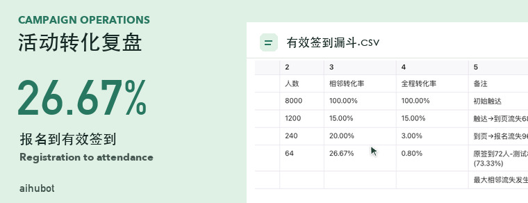

<h1 align="center"></h1>

**English** · [简体中文](README.zh-CN.md)

**Give a Bot a brief. Open the first draft, ask for a change, and get the revised file in the same conversation.** aihubot is a self-hosted workspace for small teams, with a model you choose.

[Six office recordings](docs/office-workflows.md) · [Quick start](#quick-start) · [Download](https://github.com/zhiruiai/aihubot/releases/latest) · [Try a delivered website](https://zhiruiai.github.io/aihubot/en/)

## Reconcile a duplicated refund

A shop reports 2,200 in refunds. One refund was entered twice. Open the first reconciliation, ask the Bot to correct it and inspect the revised ledger.

[](docs/office-workflows.md#refunds)

[Open the actual reconciliation](docs/demo/office-results/refunds.md)

## Six office workflows

Each card opens the recording, the review request and the actual final file. These tasks ran with a real model and the Rust service in an isolated workspace using fictional business data. The recordings replay the saved conversations in the product UI, omit waiting time and include Chinese and English captions.

| Numbers & decisions | Writing & research |
| --- | --- |
| [](docs/office-workflows.md#refunds) | [](docs/office-workflows.md#editorial) |
| [](docs/office-workflows.md#funnel) | [](docs/office-workflows.md#minutes) |
| [](docs/office-workflows.md#sourcing) | [](docs/office-workflows.md#interviews) |

## Quick start

- **Join a team.** Open your administrator’s product URL in a browser, or enter it in the macOS Apple Silicon or Windows x64 connection client. Extract the full Windows ZIP before starting the app.
- **Host a workspace.** The Linux x64 package includes the Rust API, both web apps and the workers. Follow the guide to install the Node.js dependencies and configure a private data directory. [Linux installation](server/api/deployment/README.md#install-and-configure)
- **Work on this Mac.** The macOS source build with the bundled runtime can start a local personal workspace and execute approved tasks. The public v0.0.8 desktop clients connect to a separate server. That release uses the former **BambooShift** name. If your old update checker cannot follow the rename, download subsequent releases directly. [Desktop setup](docs/desktop-client.md) · [Releases](https://github.com/zhiruiai/aihubot/releases)

### Run from source

Install stable Rust, Node.js 22.19 or later and npm.

```sh
git clone https://github.com/zhiruiai/aihubot.git
cd aihubot
npm ci
npm run configure:local
npm run dev
```

Open the product URL printed in the terminal. Under **Settings → Models**, save your provider URL, model name and API key, then select **Set as default**. Each Bot inherits the workspace default unless you assign another profile. [Configuration guide](docs/quickstart.en.md)

### Try your first task

> Turn these meeting notes into a Markdown action list and deliver the file here. The content team owes 12 guides on Wednesday. The operations lead owes five reviews on Friday. The budget is still open.

Open the file card. Ask the Bot to split the 12 guides across Wednesday and Thursday. Check that the total stays at 12 and the budget remains open. To try a local walkthrough before connecting a provider, run `npm run dev:preview` with its scripted model and temporary workspace. [Preview instructions](CONTRIBUTING.md#run-a-sample-task-locally)

## Websites, skills and publishing

- **Website delivery.** Open a delivered site from chat, compare revisions, revisit the first version and continue in its original thread. The version-history recording shows saved deliveries from a real model. The playable Starport Landing example comes from a scripted conversation. [Version-history recording](docs/demo/website-delivery.gif) · [Play Starport Landing](https://zhiruiai.github.io/aihubot/en/)
- **Install and run a skill.** In the Bot’s settings, open **Choose and manage skills → Choose from skill library**. Inspect the files in **Data quality review**, install it, attach a CSV and select the skill with `/`. Its Python script returns an exit code and row statistics. The execution Mac needs Python 3 and local command access. [Skill packages and execution](docs/bot-models-and-skills.md)
- **Team and publishing.** Pick a ready-made team in the Bot Gallery or describe the role to the recruiter. For external publishing, configure a supported account and verify the platform receipt. The editorial recording above ends at a reviewed script. [Team templates](docs/bot-templates.md) · [Publishing accounts](docs/publishing.md)

## Architecture and contributing

React powers the web and Electron workspace. Rust owns task state, permissions, receipts and workspace SQLite data. The Pi worker calls the configured model and requests tools from Rust. MCP connections expose authorized external tools. Flutter is available as source. [Architecture](docs/architecture.md) · [Protocol support and limits](docs/capabilities-and-protocols.md)

Original project code is MIT licensed. Bundled artwork, skills and dependencies retain their respective licenses. [Contribute](CONTRIBUTING.md) · [Report a problem](https://github.com/zhiruiai/aihubot/issues) · [Security](SECURITY.md) · [MIT license](LICENSE) · [Third-party notices](THIRD_PARTY.md)
